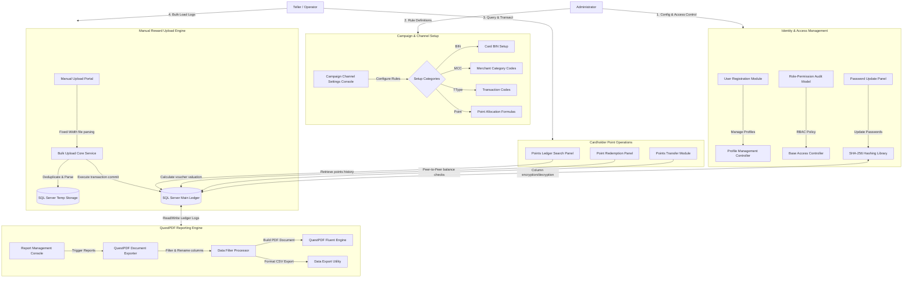

# 💳 Loyalty Points Management System 2.0

## 🔒 Source Code Availability
> [!IMPORTANT]
> **Proprietary Software Notice**  
> This project is a proprietary enterprise banking application developed for a financial institution. Due to confidentiality agreements and corporate intellectual property rights, the source code cannot be made public. This repository serves as a portfolio showcase outlining the system architecture, validation schemas, security workflows, and database designs.

---

## 📋 System Architecture

The following diagram maps the entire system components, showing how administrative and operator features communicate with service layers, cryptographic helpers, database storage, and document builders:

---

## ⚙️ Core Subsystems & Technical Implementation

### 1. Identity & Access Management (IAM)
Implements secure user registration, profiles configuration, and access boundaries:
- **Custom RBAC Policy**: Evaluates active roles and permissions dynamically mapped via custom role-permission relationships. A base access controller filters page requests, restricting operational tellers from accessing administrative panels.
- **Secure Credentials**: Hashes administrator passwords using SHA-256 before database insertion, incorporating salt keys to prevent dictionary attacks.

### 2. Campaign & Channel Setup
Enables administrators to dynamically customize the points reward engine. The campaign manager supports several distinct configuration views:
- **Channel Setup**: Defines core reward triggers and channel descriptions.
- **Card BIN Management**: Configures specific card Bank Identification Numbers, enabling custom reward tiers depending on card status (e.g., Gold, Platinum, Infinite).
- **Transaction Type Mapping**: Maps transaction codes (ATM, POS, E-Commerce, International) to distinct point limits.
- **Merchant Category Code (MCC) Rules**: Allocates point ratios based on industry sector codes.
- **Merchant Promo Allocations**: Creates custom reward partnerships (e.g., promotional triple-point campaigns at specific merchants).
- **Point Setup Formula**: Defines the base point multiplication formula (points per unit currency spent).

### 3. Manual Reward Upload (MFU) Engine
An automated bulk transaction processor built to parse and award points from offline terminal files:
- **Fixed-Width Parsing**: Reads raw terminal streams where every row is formatted with fixed-width character offsets, validating character boundaries.
- **Filename Check & Deduplication**: Prevents duplicate point awards by comparing filename patterns against processed file histories.
- **Rules Checker**: Evaluates individual records against active rules (Transaction Type, MCC, Identity details, Card Number), recording validation errors in an audit log.
- **Transactional Commit**: Uses transactional boundaries to insert batch rewards on an all-or-nothing basis, rolling back all records if a critical error occurs.

### 4. Cardholder Point Operations (Teller Ledger)
Enables operators at branch level to query and manage rewards:
- **Points Ledger Audit**: Queries cardholder profiles using identification criteria to compile historical debit/credit logs.
- **Points Redemption**: Supports point redemption for retail vouchers, cashback, or partner points. Incorporates UI constraints blocking decimal inputs to maintain integer-only points balances in the database.
- **Points Transfer**: Allows transferring points balance between validated cardholders.

### 5. Document Reporting Engine
Generates high-performance financial statement reports replicating legacy Crystal Reports formats:
- **QuestPDF Integration**: Implements a modern fluent PDF engine to build professional, border-aligned PDF documents without rendering performance bottlenecks.
- **Supported Layouts**:
  - **Allocation Report**: Details card numbers, cardholder ID details, transaction descriptions, transaction dates, debit/credit flags, transaction amounts, and points earned.
  - **Redemption Report**: Details merchant IDs, cardholder ID details, debit/credit flags, transaction nature, and redemption IDs.
  - **Portfolio Report**: Summarizes overall cardholder portfolios, totals, and balances.
- **Multi-Format Exporting**: Supports column filtering and renaming for both layout-aligned PDFs and data-centric CSV/Excel file exports.

---

## 🛠️ System Architecture Stack

| Layer | Technology | Role |
| :--- | :--- | :--- |
| **Presentation (Web)** | C# ASP.NET Core Razor Pages | UI templates, form submissions, input validation constraints |
| **Business Logic** | C# Services & Interfaces | Transaction parsing, file format validations, encryption hooks |
| **PDF Reporting** | QuestPDF | Fluent-API generation for PDF reports |
| **Storage & Database** | Entity Framework Core, SQL Server | Relational storage, bulk database inserts, audit logs |
| **Security Suite** | AES-256, SHA-256 Cryptography | Cardholder encryption, admin authentication |

---

## 📄 License

This portfolio showcase and project walkthrough documentation are licensed under the MIT License -
